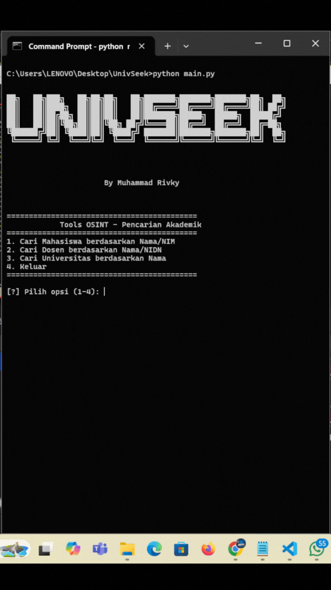

# UnivSeek ✨


## 📚 Tentang UnivSeek

**UnivSeek** adalah alat OSINT (Open Source Intelligence) yang dirancang untuk mencari informasi akademik seperti **Mahasiswa, Dosen, dan Universitas** secara cepat dan mudah!

Dengan UnivSeek, Anda bisa melakukan pencarian hanya dengan menggunakan nama, NIM, NIDN, atau nama universitas. Sangat cocok untuk keperluan riset akademik, pelacakan data, atau sekadar ingin mencari tahu informasi tentang kampus dan penghuninya.

> "Ilmu pengetahuan adalah kunci, dan UnivSeek adalah pintunya!"

---

## 🌟 Fitur Utama
- 🎓 **Cari Mahasiswa** berdasarkan **Nama, NIM, atau Universitas**
- 👨‍🎓 **Cari Dosen** berdasarkan **Nama, NIDN, atau Universitas**
- 🏫 **Cari Universitas** hanya dengan **Nama**
- ⚠ **Validasi Otomatis**: Tidak bisa mencari mahasiswa dengan NIDN atau dosen dengan NIM
- 🌐 **Mode Interaktif & Command-Line** untuk fleksibilitas pencarian
- 🚀 **Cepat dan Akurat!**

---

## 🛠 Instalasi

Sebelum menjalankan **UnivSeek**, pastikan Anda sudah menginstall **Python 3.6+**.

### 1. Clone Repository
```bash
 git clone https://github.com/username/univseek.git
 cd univseek
```

### 2. Install Dependencies
```bash
pip install -r requirements.txt
```

---

## 🔎 Cara Penggunaan

### 💻 Mode Command-Line

#### ✅ **Cari Mahasiswa**
```bash
python main.py --mahasiswa "Nama Mahasiswa" --nim 123456 --univ "Nama Universitas"
```
#### ✅ **Cari Dosen**
```bash
python main.py --dosen "Nama Dosen" --nidn 789101 --univ "Nama Universitas"
```
#### ✅ **Cari Universitas**
```bash
python main.py --univ "Nama Universitas"
```

#### ⚠ **Error Handling (Validasi Otomatis)**
Jika Anda mencoba melakukan pencarian yang tidak valid seperti:
```bash
python main.py --mahasiswa "Nama Mahasiswa" --nidn 123456
```
🔴 Akan muncul pesan error:
```
[!] Error: Mahasiswa tidak boleh dicari dengan NIDN.
```

---

### 🎮 Mode Interaktif
Jika tidak ingin menggunakan command-line, cukup jalankan program tanpa argumen:
```bash
python main.py
```
Anda akan disambut dengan menu interaktif:
```
[1] Cari Mahasiswa
[2] Cari Dosen
[3] Cari Universitas
[4] Keluar
```

---

## 👤 Kontributor
- **Muhammad Rivky** - *Developer*
- **UnivSeek Community** - *Feedback & Support*

## Preview



## 📈 Lisensi
Proyek ini dirilis di bawah lisensi **MIT License**. Silakan gunakan dan kontribusi!
MIT License

Copyright (c) 2025 Muhrivky67

Permission is hereby granted, free of charge, to any person obtaining a copy
of this software and associated documentation files (the "Software"), to deal
in the Software without restriction, including without limitation the rights
to use, copy, modify, merge, publish, distribute, sublicense, and/or sell
copies of the Software, and to permit persons to whom the Software is
furnished to do so, subject to the following conditions:

The above copyright notice and this permission notice shall be included in all
copies or substantial portions of the Software.

THE SOFTWARE IS PROVIDED "AS IS", WITHOUT WARRANTY OF ANY KIND, EXPRESS OR
IMPLIED, INCLUDING BUT NOT LIMITED TO THE WARRANTIES OF MERCHANTABILITY,
FITNESS FOR A PARTICULAR PURPOSE AND NONINFRINGEMENT. IN NO EVENT SHALL THE
AUTHORS OR COPYRIGHT HOLDERS BE LIABLE FOR ANY CLAIM, DAMAGES OR OTHER
LIABILITY, WHETHER IN AN ACTION OF CONTRACT, TORT OR OTHERWISE, ARISING FROM,
OUT OF OR IN CONNECTION WITH THE SOFTWARE OR THE USE OR OTHER DEALINGS IN THE
SOFTWARE.


**💡 Punya ide atau saran? Jangan ragu untuk membuka Issue atau Pull Request!**

---

💖 **UnivSeek - Membuka Jendela Akademik Dunia!**

